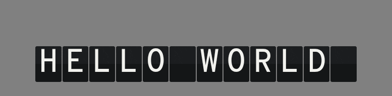

# svelte-split-flap

A self-contained [split-flap](https://en.wikipedia.org/wiki/Split-flap_display) (airport
departure board) text display for **Svelte 5**.

Each cell flips mechanically through an ordered charset instead of jumping straight to the
target character, with a per-cell stagger so a whole row cascades. The cell count is fixed by a
`length` prop, so the board never reflows as the text changes.



- Forward-only cycling through the charset, like real hardware (wrapping at the end).
- Only vertical scaling changes, the z-axis is ignored. This creates a nice flipping
  effect that keeps the mechanical feel while not being too cluttered.
- Animates only `transform`/`opacity`; `will-change` is applied only while a cell is animating.
- Respects `prefers-reduced-motion` (snaps straight to the final text).
- Accessible: animated cells are `aria-hidden` and the real text is exposed to screen readers.
- Ships its font (Overpass Mono) and styles, so it works out of the box. Everything is themeable
  through `--sf-*` custom properties.

## Installation

This package is not published to npm. Use it directly from GitHub:

```bash
npm install github:nate-noscope/svelte-split-flap
```

Installing from Git runs the package's build, so the compiled `dist/` is present.

Or copy `src/lib/` into your project and import it locally.

## Usage

```svelte
<script lang="ts">
	import { SplitFlapDisplay } from 'svelte-split-flap';

	let text = $state('HELLO');
</script>

<SplitFlapDisplay {text} length={8} align="center" stepMs={70} stagger={35} />
```

`text` is padded or truncated to exactly `length` cells, so changing the text never changes the
board's width.

## Props

| Prop      | Type                            | Default           | Description                                                                                           |
| --------- | ------------------------------- | ----------------- | ----------------------------------------------------------------------------------------------------- |
| `text`    | `string`                        | — (required)      | Text to display. Padded/truncated to `length`.                                                        |
| `length`  | `number`                        | — (required)      | Fixed number of character cells.                                                                      |
| `align`   | `'left' \| 'right' \| 'center'` | `'left'`          | How to align `text` when padding.                                                                     |
| `charSet` | `readonly string[]`             | `DEFAULT_CHARSET` | Ordered character set cycled through.                                                                 |
| `stepMs`  | `number`                        | `80`              | Duration of a single character step (ms).                                                             |
| `stagger` | `number`                        | `40`              | Per-cell start delay, `index * stagger` (ms).                                                         |
| `intro`   | `boolean`                       | `true`            | Animate from blank on mount. Set `false` for many boards to render instantly (updates still animate). |

The default charset is space, `A`–`Z`, `0`–`9`, then `.,!?':-/&`. Characters in `text` that are
not present in `charSet` throw a clear error.

## Theming

All visual values are CSS custom properties set on `.sf-display`. Override them in your own CSS:

```css
.split-flap-wrap :global(.sf-display) {
	--sf-font-size: 2rem;
	--sf-cell-width: calc(var(--sf-font-size) * 0.8);
	--sf-cell-height: calc(var(--sf-font-size) * 1.1);
	--sf-bg: #1b1d1f;
	--sf-bg-edge: #141617;
	--sf-fg: #f2f2ee;
	--sf-border: rgba(255, 255, 255, 0.08);
	--sf-shadow-max: 0.55;
	--sf-gap: 0.125rem;
	--sf-radius: 0.25rem;
	--sf-font-family: 'Overpass Mono Variable', ui-monospace, monospace;
}
```

## Accessibility

The flapping cells are hidden from assistive technology, and the final `text` is exposed through a
visually hidden element. When the user prefers reduced motion, the component skips the animation
and renders the target text immediately.

## Development

```bash
nix develop        # or bring your own Node 22
npm install
npm run dev        # demo at http://localhost:5173
npm test           # unit + component tests
npm run package    # build the library to dist/
npm run check      # svelte-check
```

## License

[MIT](./LICENSE). The bundled Overpass Mono font is under the SIL Open Font License.
